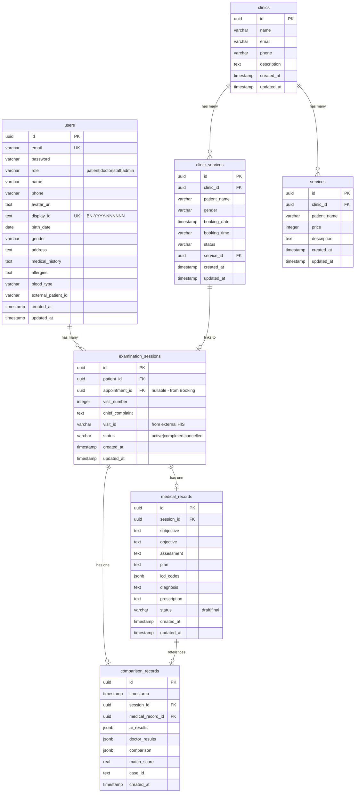
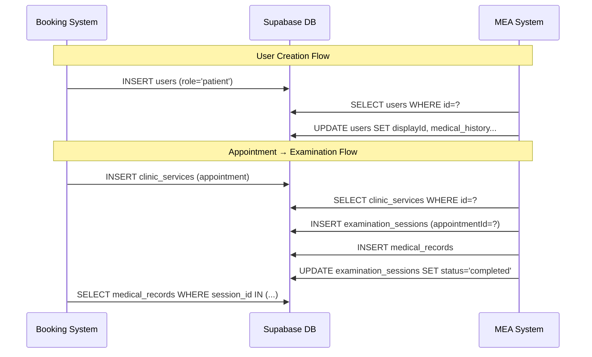

# Medical Examination Assistant (MEA) - System Documentation

> Tài liệu kỹ thuật dành cho việc tích hợp MEA với hệ thống Booking
> **Phiên bản**: 1.0.0 | **Cập nhật**: 2025-12-31

---

## 📋 Mục lục

1. [Tổng quan hệ thống](#1-tổng-quan-hệ-thống)
2. [Kiến trúc hệ thống](#2-kiến-trúc-hệ-thống)
3. [Database Schema](#3-database-schema)
4. [API Reference](#4-api-reference)
5. [Services Layer](#5-services-layer)
6. [AI Agents](#6-ai-agents)
7. [Điểm tích hợp với Booking](#7-điểm-tích-hợp-với-booking)
8. [Hướng dẫn tích hợp](#8-hướng-dẫn-tích-hợp)

---

## 1. Tổng quan hệ thống

### 1.1 Mô tả

Medical Examination Assistant (MEA) là hệ thống hỗ trợ khám bệnh thông minh, sử dụng AI để:

- **Ghi âm và chuyển đổi** giọng nói thành văn bản (Speech-to-Text)
- **Phân tích nội dung** và xác định vai trò người nói (Bác sĩ/Bệnh nhân)
- **Tự động tạo bệnh án SOAP** từ transcript hội thoại
- **Gợi ý mã ICD-10** phù hợp với chẩn đoán
- **Tư vấn y khoa** dựa trên RAG (Retrieval-Augmented Generation)
- **So sánh kết quả AI vs Bác sĩ** để đánh giá chất lượng

### 1.2 Tech Stack

| Component | Technology |
|-----------|------------|
| Frontend | Next.js 16.1, React 19, TailwindCSS v4 |
| Backend | Next.js API Routes (App Router) |
| Database | PostgreSQL (Supabase) |
| ORM | Drizzle ORM |
| AI/LLM | Groq API (OpenAI GPT-OSS models) |
| STT | Groq Whisper Large v3 |
| RAG | LangChain + Google Embeddings |
| Vector Store | MemoryVectorStore (LangChain) |

### 1.3 Luồng xử lý chính

```
┌─────────────────────────────────────────────────────────────────┐
│                      EXAMINATION FLOW                            │
├─────────────────────────────────────────────────────────────────┤
│                                                                  │
│  Step 1: Session Initialization                                  │
│  ├─ Tạo/Chọn bệnh nhân                                          │
│  └─ Tạo phiên khám mới                                          │
│                                                                  │
│  Step 2: Audio Recording & STT                                   │
│  ├─ Ghi âm hội thoại                                            │
│  ├─ Whisper STT → Văn bản                                       │
│  ├─ LLM Role Detection (Bác sĩ/Bệnh nhân)                       │
│  └─ Medical Text Fixer                                          │
│                                                                  │
│  Step 3: AI Analysis                                             │
│  ├─ Scribe Agent → SOAP Notes                                   │
│  ├─ ICD-10 Agent → Mã bệnh                                      │
│  └─ Medical Expert Agent → Tư vấn (RAG)                         │
│                                                                  │
│  Step 4: Doctor Review & Edit                                    │
│  ├─ Bác sĩ xem xét kết quả AI                                   │
│  ├─ Chỉnh sửa nếu cần                                           │
│  └─ Lưu bệnh án (Draft/Final)                                   │
│                                                                  │
│  Step 5: Comparison & Sync                                       │
│  ├─ So sánh AI vs Bác sĩ (Semantic Similarity)                  │
│  ├─ Lưu kết quả so sánh                                         │
│  └─ Đồng bộ với HIS (nếu có visitId)                            │
│                                                                  │
└─────────────────────────────────────────────────────────────────┘
```

---

## 2. Kiến trúc hệ thống

### 2.1 Cấu trúc thư mục

```
medical-examination-assistant/
├── src/
│   ├── app/                      # Next.js App Router
│   │   ├── api/                  # API Routes
│   │   │   ├── admin/            # Admin endpoints
│   │   │   ├── analyze/          # AI Analysis endpoint
│   │   │   ├── comparison/       # Comparison endpoints
│   │   │   ├── dashboard/        # Dashboard data
│   │   │   ├── his/              # HIS Integration mock
│   │   │   ├── medical-record/   # Medical records CRUD
│   │   │   ├── patient/          # Patient CRUD
│   │   │   ├── patients/         # Patient list/search
│   │   │   ├── session/          # Session management
│   │   │   └── stt/              # Speech-to-Text
│   │   ├── dashboard/            # Dashboard page
│   │   ├── examination/          # Examination page
│   │   ├── patient/              # Patient pages
│   │   └── session/              # Session pages
│   │
│   ├── components/               # React Components
│   │   ├── ui/                   # UI primitives
│   │   ├── MatchingEngine.tsx    # AI vs Doctor comparison
│   │   ├── MedicalRecordReview.tsx
│   │   ├── PatientFormModal.tsx
│   │   ├── PatientSearchModal.tsx
│   │   └── SessionInitForm.tsx
│   │
│   └── lib/                      # Core Libraries
│       ├── agents/               # AI Agents (LangGraph)
│       │   ├── graph.ts          # LangGraph workflow
│       │   ├── nodes.ts          # Agent nodes
│       │   ├── state.ts          # Agent state types
│       │   ├── comparison.ts     # Comparison logic
│       │   └── models.ts         # LLM model config
│       │
│       ├── db/                   # Database Layer
│       │   ├── index.ts          # DB connection
│       │   ├── schema-users.ts   # Users table
│       │   ├── schema-session.ts # Sessions & Records
│       │   ├── schema-booking.ts # Booking reference
│       │   └── schema.ts         # Comparison records
│       │
│       ├── integrations/         # External Systems
│       │   └── hisClient.ts      # HIS API client
│       │
│       ├── rag/                  # RAG System
│       │   └── vectorStore.ts    # Vector store
│       │
│       └── services/             # Business Logic
│           ├── userService.ts    # User/Patient CRUD
│           ├── sessionService.ts # Session management
│           └── dashboardService.ts
│
└── data/
    └── knowledge_base/
        └── protocols/            # Medical knowledge .md files
```

### 2.2 Sơ đồ kiến trúc

```mermaid
graph TB
    subgraph Frontend
        UI[React Components]
        Pages[Next.js Pages]
    end

    subgraph API["API Routes"]
        PatientAPI[/api/patient/*]
        SessionAPI[/api/session/*]
        STTAPI[/api/stt]
        AnalyzeAPI[/api/analyze]
        RecordAPI[/api/medical-record/*]
        CompareAPI[/api/comparison/*]
        DashboardAPI[/api/dashboard/*]
    end

    subgraph Services
        UserService[userService]
        SessionService[sessionService]
        DashboardService[dashboardService]
    end

    subgraph AI["AI Layer"]
        STT[Whisper STT]
        Agents[LangGraph Agents]
        RAG[RAG Vector Store]
        Compare[Comparison Engine]
    end

    subgraph Database
        Supabase[(PostgreSQL/Supabase)]
    end

    subgraph External
        HIS[HIS System]
        Groq[Groq API]
        Google[Google Embeddings]
    end

    UI --> Pages
    Pages --> API
    API --> Services
    Services --> Database

    STTAPI --> STT
    STT --> Groq
    AnalyzeAPI --> Agents
    Agents --> RAG
    Agents --> Groq
    RAG --> Google
    CompareAPI --> Compare
    Compare --> Google

    SessionService --> HIS
```

---

## 3. Database Schema

### 3.1 Entity Relationship Diagram



### 3.2 Chi tiết các bảng

#### 3.2.1 `users` - Bảng người dùng hợp nhất

> **Quan trọng**: Bảng này hợp nhất dữ liệu từ cả MEA (patients) và Booking (users)

```typescript
interface User {
    // Primary Key
    id: string;               // UUID auto-generated

    // Authentication & Role (from Booking)
    email: string;            // Required, unique
    password: string | null;  // Hashed, nullable for OAuth
    role: 'patient' | 'doctor' | 'staff' | 'admin';

    // Basic Information
    name: string;             // Required
    phone: string | null;
    avatarUrl: string | null;

    // Patient-specific fields (from MEA)
    displayId: string | null; // BN-2024-000001, auto-generated
    birthDate: string | null; // YYYY-MM-DD format
    gender: string | null;
    address: string | null;

    // Medical Information (from MEA)
    medicalHistory: string | null;
    allergies: string | null;
    bloodType: string | null;

    // External Integration
    externalPatientId: string | null; // ID from HIS system

    // Metadata
    createdAt: Date;
    updatedAt: Date;
}
```

**Điểm tích hợp với Booking**:
- Cả Booking và MEA sử dụng chung bảng `users`
- Role `patient` dành cho bệnh nhân
- `displayId` chỉ được tạo cho bệnh nhân (role = 'patient')
- Booking có thể tạo user trước → MEA bổ sung thông tin y tế

#### 3.2.2 `examination_sessions` - Phiên khám

```typescript
interface ExaminationSession {
    id: string;               // UUID
    patientId: string;        // FK to users.id
    appointmentId: string | null; // FK to clinic_services.id (from Booking)
    visitNumber: number;      // Lần khám thứ n
    chiefComplaint: string | null; // Lý do khám
    visitId: string | null;   // ID from external HIS
    status: 'active' | 'completed' | 'cancelled';
    createdAt: Date;
    updatedAt: Date;
}
```

**Điểm tích hợp với Booking**:
- `appointmentId` liên kết với `clinic_services.id` từ hệ thống Booking
- Cho phép tạo session từ appointment đã đặt lịch

#### 3.2.3 `medical_records` - Bệnh án

```typescript
interface MedicalRecord {
    id: string;
    sessionId: string;        // FK to examination_sessions.id

    // SOAP Note Components (MEA primary use)
    subjective: string | null;  // Triệu chứng chủ quan
    objective: string | null;   // Triệu chứng khách quan
    assessment: string | null;  // Chẩn đoán
    plan: string | null;        // Kế hoạch điều trị

    // ICD-10 Codes
    icdCodes: string[];       // ["K29.7", "I10"]

    // Booking compatibility fields
    diagnosis: string | null;     // = assessment
    prescription: string | null;  // = plan

    status: 'draft' | 'final';
    createdAt: Date;
    updatedAt: Date;
}
```

**Điểm tích hợp với Booking**:
- `diagnosis` và `prescription` trùng với SOAP fields
- Booking có thể đọc dữ liệu qua các fields này

#### 3.2.4 `comparison_records` - Kết quả so sánh AI vs Doctor

```typescript
interface ComparisonRecord {
    id: string;
    timestamp: Date;
    sessionId: string | null;
    medicalRecordId: string | null;

    aiResults: {
        soap: SoapNote;
        icdCodes: string[];
        medicalAdvice: string;
        references: string[];
    };

    doctorResults: {
        soap: SoapNote;
        icdCodes: string[];
    };

    comparison: {
        matchScore: number;     // 0-100
        soapMatch: {
            subjective: number;
            objective: number;
            assessment: number;
            plan: number;
        };
        icdMatch: {
            exactMatches: string[];
            aiOnly: string[];
            doctorOnly: string[];
            score: number;
        };
        differences: string[];
    };

    matchScore: number;       // Overall score 0-100
    caseId: string | null;
    createdAt: Date;
}
```

---

## 4. API Reference

### 4.1 Patient/User APIs

#### `POST /api/patient/create` - Tạo bệnh nhân mới

```typescript
// Request
{
    patientData: {
        name: string;           // Required
        email: string;          // Required
        phone?: string;
        birthDate?: string;     // YYYY-MM-DD
        gender?: string;
        address?: string;
        medicalHistory?: string;
        allergies?: string;
        bloodType?: string;
        externalPatientId?: string;
    };
    force?: boolean;            // Bypass duplicate check
}

// Response - Success
{
    success: true,
    patient: User
}

// Response - Duplicate Found (409)
{
    success: false,
    error: "POSSIBLE_DUPLICATE",
    duplicates: User[]
}
```

#### `GET /api/patient/:patientId` - Lấy thông tin bệnh nhân

```typescript
// Response
{
    success: true,
    patient: User
}
```

#### `DELETE /api/patient/:patientId` - Xóa bệnh nhân

⚠️ **CASCADE DELETE**: Xóa tất cả sessions và medical records liên quan

```typescript
// Response
{
    success: true,
    message: "Đã xóa bệnh nhân BN-2024-000001 và tất cả hồ sơ liên quan"
}
```

#### `GET /api/patients` - Danh sách bệnh nhân

```typescript
// Query params
?q=<search_term>&page=1&limit=20

// Response
{
    patients: PatientSearchResult[],
    total: number,
    pages?: number
}

interface PatientSearchResult {
    id: string;
    displayId: string | null;
    name: string;
    birthDate: string | null;
    phone: string | null;
    totalVisits: number;
    lastVisitDate: Date | null;
}
```

#### `GET /api/patient/:patientId/sessions` - Lịch sử khám của bệnh nhân

```typescript
// Response
{
    success: true,
    sessions: (ExaminationSession & { medicalRecord: MedicalRecord | null })[],
    total: number
}
```

---

### 4.2 Session APIs

#### `POST /api/session/create` - Tạo phiên khám mới

Hỗ trợ 2 format:

**Format mới (khuyến nghị):**
```typescript
// Request
{
    patientId: string;          // Required
    chiefComplaint?: string;
    visitId?: string;           // From HIS
}

// Response
{
    success: true,
    message: "Phiên khám đã được tạo thành công",
    data: ExaminationSession
}
```

**Format cũ (backward compatible):**
```typescript
// Request
{
    patientName: string;        // Auto-create patient
    patientInfo?: {
        gender?: string;
        address?: string;
        phoneNumber?: string;
        age?: number;
    };
    medicalHistory?: string;
    chiefComplaint?: string;
    visitId?: string;
}

// Response includes patient info
{
    success: true,
    data: {
        ...session,
        patientName: string,
        patientDisplayId: string,
        patient: User
    }
}
```

#### `GET /api/session/:sessionId` - Chi tiết phiên khám

```typescript
// Response
{
    success: true,
    data: {
        session: ExaminationSession,
        medicalRecord: MedicalRecord | null
    }
}
```

#### `DELETE /api/session/:sessionId` - Xóa phiên khám

```typescript
// Response
{
    success: true,
    message: "Xóa phiên khám thành công"
}
```

---

### 4.3 Medical Record APIs

#### `POST /api/medical-record/save` - Lưu bệnh án

```typescript
// Request
{
    sessionId: string;          // Required
    subjective?: string;
    objective?: string;
    assessment?: string;        // Required for final
    plan?: string;
    icdCodes?: string[];        // Required for final
    status: "draft" | "final";  // Required
}

// Response
{
    success: true,
    message: "Bệnh án đã được lưu và đồng bộ với HIS",
    data: MedicalRecord
}
```

**Khi status = "final":**
- Tự động cập nhật session status → "completed"
- Đồng bộ với HIS nếu có visitId

---

### 4.4 Speech-to-Text API

#### `POST /api/stt` - Chuyển âm thanh thành văn bản

```typescript
// Request: FormData
{
    file: Blob;                 // Audio file (WAV)
}

// Response
{
    success: true,
    segments: ProcessedSegment[],
    raw_text: string,
    num_speakers: number
}

interface ProcessedSegment {
    start: number;              // Timestamp start
    end: number;                // Timestamp end
    role: "Bác sĩ" | "Bệnh nhân";
    raw_text: string;
    clean_text: string;         // Medical terms fixed
}
```

**Processing Pipeline:**
1. **Whisper STT** (Groq) - Chuyển audio → text với timestamps
2. **LLM Role Detection** - Xác định ai là Bác sĩ, ai là Bệnh nhân
3. **Medical Text Fixer** - Sửa lỗi thuật ngữ y khoa (VD: "thượng vịt" → "thượng vị")

---

### 4.5 AI Analysis API

#### `POST /api/analyze` - Phân tích transcript

```typescript
// Request
{
    transcript: string;         // Full conversation transcript
}

// Response
{
    success: true,
    data: {
        soap: {
            subjective: string;
            objective: string;
            assessment: string;
            plan: string;
        },
        icdCodes: string[],         // ["K29.7 - Viêm dạ dày", ...]
        medicalAdvice: string,       // Expert advice with references
        references: string[]         // Document sources from RAG
    }
}
```

**AI Agent Pipeline:**
```
transcript → [Scribe Agent] → SOAP Note
                    ↓
              [ICD-10 Agent] → ICD Codes
              [Expert Agent] → Medical Advice (RAG-based)
```

---

### 4.6 Comparison APIs

#### `POST /api/comparison/submit` - So sánh AI vs Doctor

```typescript
// Request
{
    sessionId?: string;
    medicalRecordId?: string;
    aiResults: {
        soap: SoapNote;
        icdCodes: string[];
    };
    doctorResults: {
        soap: SoapNote;
        icdCodes: string[];
    };
}

// Response
{
    success: true,
    comparisonId: string,
    matchScore: number,         // 0-100
    analysis: ComparisonResult
}

interface ComparisonResult {
    matchScore: number;
    soapMatch: {
        subjective: number;     // 0-100
        objective: number;
        assessment: number;
        plan: number;
    };
    icdMatch: {
        exactMatches: string[];
        aiOnly: string[];
        doctorOnly: string[];
        score: number;
    };
    differences: string[];
}
```

**Semantic Comparison:**
- Sử dụng Google Embeddings để tính cosine similarity
- Weights: Assessment 30%, Plan 30%, ICD 30%, S/O 10%

#### `GET /api/comparison/session/:sessionId` - Lấy kết quả so sánh

```typescript
// Response
{
    success: true,
    comparison: ComparisonRecord | null
}
```

---

### 4.7 Dashboard API

#### `GET /api/dashboard/stats` - Thống kê dashboard

```typescript
// Query params
?page=1&limit=50

// Response
{
    success: true,
    stats: {
        today: {
            totalSessions: number;
            completedSessions: number;
            activeSessions: number;
        };
        thisWeek: {
            totalSessions: number;
            newPatients: number;
        };
        thisMonth: {
            totalSessions: number;
            newPatients: number;
        };
        total: {
            patients: number;
            sessions: number;
        };
    },
    patients: PatientSummary[],
    pagination: { page: number; limit: number }
}
```

---

### 4.8 HIS Integration APIs (Mock)

#### `GET /api/his/current-session` - Lấy session từ HIS

```typescript
// Query params
?context=true

// Response
{
    success: true,
    data: {
        visitId: string;
        patientInfo: {
            patientId: string;
            name: string;
            age: number;
            gender: string;
            address: string;
            phoneNumber: string;
        };
        context?: {             // Only if context=true
            medicalHistory: string;
            allergies: string[];
            currentMedications: string[];
            lastVisit: string;
            vitalSigns: {
                bloodPressure: string;
                heartRate: string;
                temperature: string;
                weight: string;
                height: string;
            };
        };
    }
}
```

---

## 5. Services Layer

### 5.1 userService

**Location**: `src/lib/services/userService.ts`

```typescript
// Core functions
async function createUser(input: UserInput): Promise<Result>
async function forceCreateUser(input: UserInput): Promise<User>
async function getUserById(userId: string): Promise<User | null>
async function getPatientByDisplayId(displayId: string): Promise<User | null>
async function searchPatients(query: string, options?): Promise<SearchResult>
async function listPatients(options?): Promise<ListResult>
async function updateUser(userId: string, updates: Partial<UserInput>): Promise<User | null>
async function deleteUser(userId: string): Promise<Result>

// Display ID generation
async function generateDisplayId(): Promise<string>  // BN-YYYY-NNNNNN

// Duplicate detection
async function findPossibleDuplicates(input: UserInput): Promise<User[]>

// Backward compatibility aliases
export const createPatient = createUser;
export const getPatientById = getUserById;
...
```

### 5.2 sessionService

**Location**: `src/lib/services/sessionService.ts`

```typescript
// Session management
async function createSession(input: SessionInput): Promise<Session>
async function getSession(sessionId: string): Promise<Session | null>
async function getSessionWithPatient(sessionId: string): Promise<SessionWithPatient | null>
async function updateSessionStatus(sessionId: string, status: string): Promise<void>

// Medical Record management
async function saveMedicalRecord(input: MedicalRecordInput): Promise<MedicalRecord>
async function getMedicalRecordBySession(sessionId: string): Promise<MedicalRecord | null>

// Internal: Finalize record (sync to HIS)
async function finalizeRecord(sessionId: string, record: MedicalRecord): Promise<void>
```

### 5.3 dashboardService

**Location**: `src/lib/services/dashboardService.ts`

```typescript
async function getDashboardStats(): Promise<DashboardStats>
async function getRecentSessions(limit?: number, page?: number): Promise<RecentSession[]>
async function getPatientsList(limit?: number, page?: number): Promise<PatientSummary[]>
```

---

## 6. AI Agents

### 6.1 LangGraph Workflow

**Location**: `src/lib/agents/graph.ts`

```
┌─────────┐
│  START  │
└────┬────┘
     │
     ▼
┌─────────────┐
│   SCRIBE    │──── Transcript → SOAP Note
└──────┬──────┘
       │
   ┌───┴───┐
   │       │
   ▼       ▼
┌──────┐  ┌────────┐
│ ICD  │  │ EXPERT │
└──┬───┘  └───┬────┘
   │          │
   └────┬─────┘
        │
        ▼
   ┌─────────┐
   │   END   │
   └─────────┘
```

### 6.2 Agent Descriptions

| Agent | Model | Input | Output | Description |
|-------|-------|-------|--------|-------------|
| **Scribe** | gpt-oss-120b | transcript | SOAP Note | Chuyển hội thoại thành bệnh án chuẩn SOAP |
| **ICD-10** | gpt-oss-120b | assessment + subjective | ICD codes | Gợi ý mã ICD-10 từ chẩn đoán |
| **Medical Expert** | gpt-oss-20b | SOAP + RAG context | advice | Tư vấn dựa trên y văn (RAG) |

### 6.3 State Interface

```typescript
interface AgentState {
    // Input
    transcript: string;

    // Intermediate
    soap: {
        subjective: string;
        objective: string;
        assessment: string;
        plan: string;
    };

    // Outputs
    icdCodes: string[];
    medicalAdvice: string;
    references: string[];
}
```

### 6.4 RAG System

**Location**: `src/lib/rag/vectorStore.ts`

- **Knowledge Base**: `data/knowledge_base/protocols/*.md`
- **Embeddings**: Google `text-embedding-004`
- **Vector Store**: MemoryVectorStore (LangChain)
- **Retriever**: Top-3 relevant chunks (k=3)
- **Chunk Size**: 1000 characters, 200 overlap

---

## 7. Điểm tích hợp với Booking

### 7.1 Shared Database

MEA và Booking sử dụng **cùng một Supabase database**:

```typescript
// Connection (src/lib/db/index.ts)
export const supabase = createClient(
    process.env.NEXT_PUBLIC_SUPABASE_URL!,
    process.env.NEXT_PUBLIC_SUPABASE_ANON_KEY!
);

const connectionString = process.env.DATABASE_URL!;
export const db = drizzle(client, { schema: {...} });
```

### 7.2 Shared Tables

| Table | Owner | Shared? | Notes |
|-------|-------|---------|-------|
| `users` | Both | ✅ Yes | Unified users table |
| `clinics` | Booking | ✅ Reference | MEA only reads |
| `services` | Booking | ✅ Reference | MEA only reads |
| `clinic_services` | Booking | ✅ Reference | Appointments linked to sessions |
| `examination_sessions` | MEA | ✅ Yes | Links to appointments |
| `medical_records` | MEA | ✅ Yes | Booking can read |
| `comparison_records` | MEA | ❌ No | MEA internal |

### 7.3 Integration Points

#### A. User/Patient Flow

```
Booking creates user (patient) → MEA reads user
                               → MEA adds medical info (displayId, medical_history, etc)
```

#### B. Appointment → Session Flow

```
Booking creates clinic_services (appointment)
                ↓
MEA creates examination_sessions with appointmentId
                ↓
MEA creates medical_records
                ↓
Booking reads medical_records (diagnosis, prescription)
```

#### C. Schema Mapping

```typescript
// Booking reads MEA medical records via:
{
    diagnosis: medical_records.assessment || medical_records.diagnosis,
    prescription: medical_records.plan || medical_records.prescription,
    icd_codes: medical_records.icd_codes
}
```

### 7.4 Data Flow Diagram



---

## 8. Hướng dẫn tích hợp

### 8.1 Tạo phiên khám từ Appointment

```typescript
// 1. Booking tạo appointment
const appointment = await bookingService.createAppointment({
    clinic_id: "...",
    patient_name: "Nguyễn Văn A",
    booking_date: new Date(),
    booking_time: "09:00",
    service_id: "..."
});

// 2. MEA tạo session từ appointment
const response = await fetch('/api/session/create', {
    method: 'POST',
    headers: { 'Content-Type': 'application/json' },
    body: JSON.stringify({
        patientId: patient.id,          // User ID from Booking
        appointmentId: appointment.id,  // Link to appointment
        chiefComplaint: "Đau bụng"
    })
});
```

### 8.2 Đọc kết quả khám từ MEA

```typescript
// Option 1: Qua API
const response = await fetch(`/api/session/${sessionId}`);
const { data } = await response.json();
const medicalRecord = data.medicalRecord;

// Option 2: Trực tiếp từ DB
const records = await db
    .select()
    .from(medicalRecords)
    .where(eq(medicalRecords.sessionId, sessionId));
```

### 8.3 Webhook Integration (Future)

MEA có thể gửi webhook khi bệnh án được hoàn tất:

```typescript
// Suggested webhook payload
{
    event: "medical_record.finalized",
    sessionId: "...",
    appointmentId: "...",
    patientId: "...",
    data: {
        diagnosis: "...",
        prescription: "...",
        icdCodes: ["K29.7"]
    },
    timestamp: "2025-12-31T10:00:00Z"
}
```

### 8.4 Environment Variables

```bash
# Database
NEXT_PUBLIC_SUPABASE_URL=https://xxx.supabase.co
NEXT_PUBLIC_SUPABASE_ANON_KEY=eyJxxx...
DATABASE_URL=postgresql://...

# AI APIs
GROQ_API_KEY=gsk_xxx...
GOOGLE_API_KEY=AIza...

# HIS Integration (optional)
HIS_API_URL=http://his-server/api/v1/emr
```

---

## 📞 Contact

Nếu cần hỗ trợ tích hợp, vui lòng liên hệ:
- **Repository**: medical-examination-assistant
- **Documentation Version**: 1.0.0
- **Last Updated**: 2025-12-31
